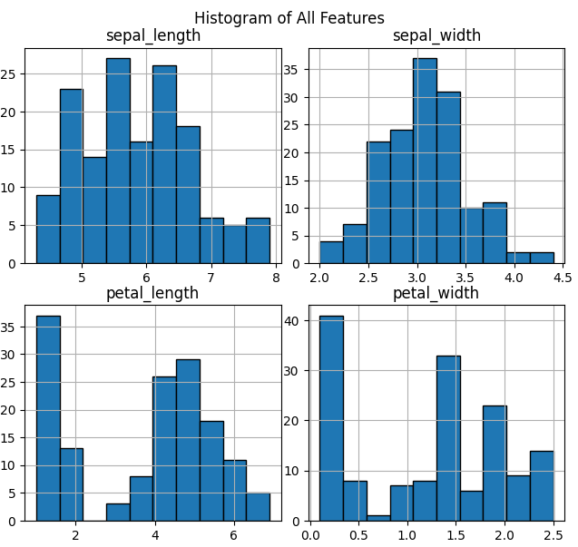

# Task 1: Iris Dataset Exploration

This script performs an exploratory data analysis (EDA) on the classic Iris dataset. It loads the data, provides summary statistics, and visualizes the relationships between different features.

## Visualizations

### Sepal Length vs. Sepal Width

### Feature Distributions

### Feature Outlier Detection

