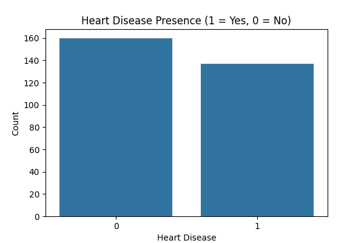
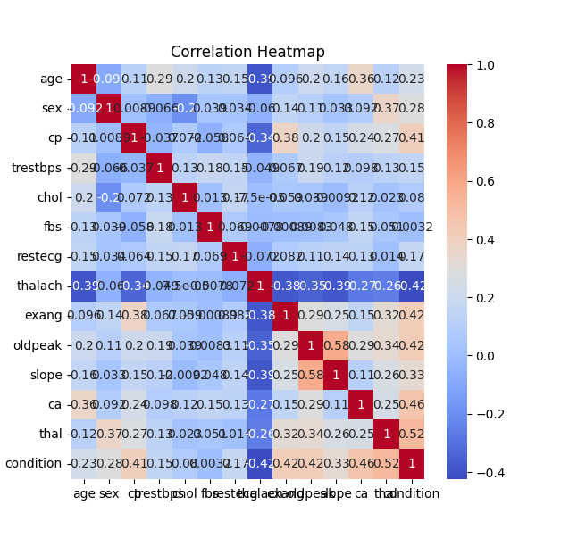
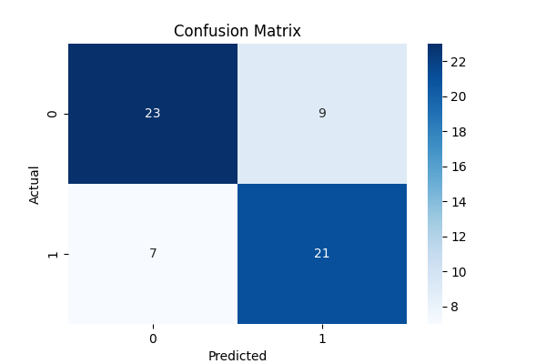
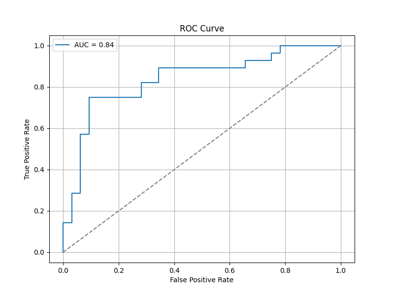
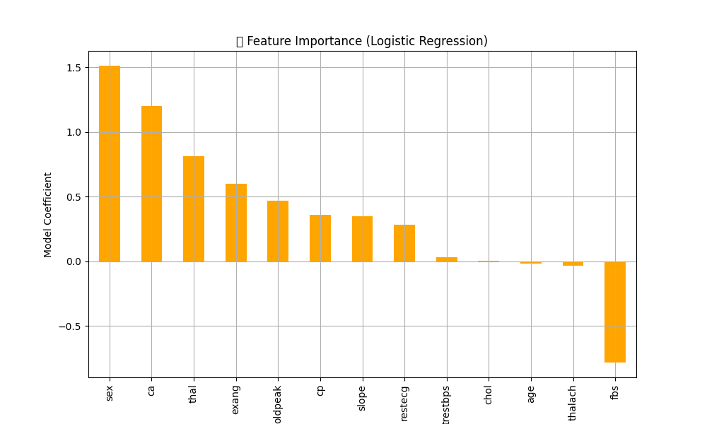

# Task 3: Heart Disease Prediction

This script builds a logistic regression model to predict the presence of heart disease based on the Cleveland Clinic Foundation heart disease dataset. It includes data loading, exploratory data analysis, model training, and evaluation.

## Visualizations

### Heart Disease Presence

### Correlation Heatmap

### Confusion Matrix

### ROC Curve

### Feature Importance
