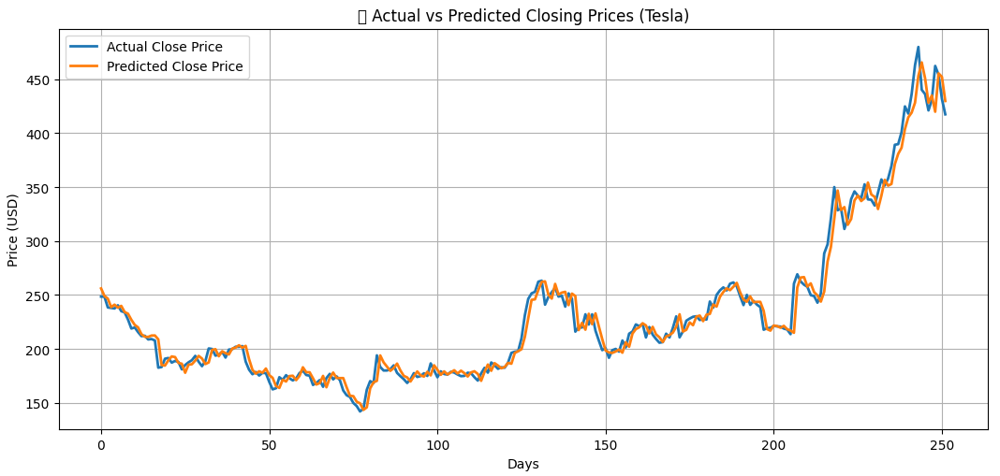

# Task 2: Stock Price Prediction

This script predicts the next day's closing price of Tesla (TSLA) stock using a simple linear regression model. It fetches historical data from Yahoo Finance, prepares the data, trains the model, and evaluates its performance.

## Visualizations

### Actual vs. Predicted Closing Prices

